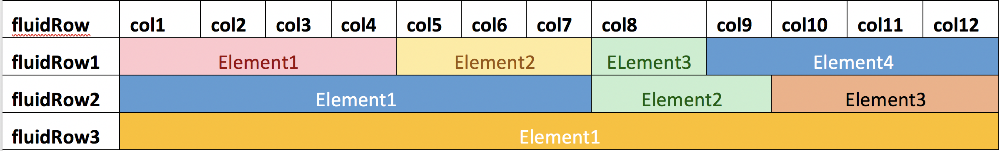

# 1. Architecture

Separate `ui.R` and `server.R`:

```
01-architecture/example-1
├── code # all .R scripts go here
├── input # input files
├── output # output files
├── server.R # update outputs using some input variable or by calling functions
├── ui.R # define layout, input and output elements
├── www # files like .css, .js, .png
└── ... # any number of directories or organization folders
```

ui and server in a single `app.R`:

```
01-architecture/example-2
├── app.R # combines ui and server in one script
└── ... # add similar directories as shown above
```

# 2. Layouts

In this section we will talk about how to arrange the shiny components i.e. inputs and outputs. These are the following types of most commonly used layouts: 

## 2.1. Fluid Page

The `fluidPage` function is used to create fluid page layouts. A fluid page layout consists of rows which in turn include columns. 

 

### 2.1.1 Sidebar layout

This is the most basic layout and is called by the function `sidebarLayout` and has three components: a title panel (`titlePanel`) used to add header or title to the application, side bar panel (`sidebarPanel`) which is used to lay out all the input components and a main panel (`mainPanel`) which is used to lay out the output components. There are two parameters to define the size and position:
- `width`: This is a panel-specific parameter. The combined width of sidebarPanel and mainPanel cannot exceed 12.
- `position`: This is a sidebarLayout parameter. Allowed values: `left` or `right` 

### 2.1.2 Grid layout

Shiny's grid system using combinations of rows (`fluidRow`) & columns (`column`). This layout is used to better organize the inputs and outputs. Rows (`fluidRow`) and Columns (`column`) define how the elements are organized horizontally and vertically. Rows exist for the purpose of making sure their elements appear on the same line. Columns exist for the purpose of defining how much width each element takes within a 12-unit wide grid.

### 2.1.3 Segmented layout

This uses Tabsets (`tabsetPanel`) or Navigation Lists (`navlistPanel`) to organize any kind of layout into discrete sections. Navigation lists can be used when you want to subdivide tabsets into sub-sections.

## 2.2. Navbar Pages

This allows for multiple sub-components: each with their own layout for e.g. sidebar, grid, tabsets etc. Here, instead of `fluidPage`, use `navbarPage`.

## 2.3. Dashboards
 
Dashboards can incorporate various layouts in one application similar to a `navbarPage` but more sophisticated. Shiny dashboards have three components: the header (`dashboardHeader`) used to add header or title to the application, the side bar (`dashboardSidebar`) which is used to lay out all the menu items and sub-items and the body (`dashboardBody`) which is used to lay out all the inputs and outputs using any of the above discussed layouts.

# 3. Inputs and Outputs

The goal of inputs is to provide a set of parameters that are passed on to a function which executes a set of commands in order to generate an output. In shiny jargon, inputs are called as `reactive sources` and outputs are called as `reactive endpoints`. 

## 3.1. Inputs:

Different types of input widgets and their return values are listed below:

| Input            | Return value                                                   |
|------------------|----------------------------------------------------------------|
| Single checkbox  | Logical                                                        |
| Radio buttons    | Character                                                      |
| Select box       | Character or character vector (if `multiple = TRUE`)           |
| Numeric input    | Numeric                                                        |
| Text input       | Character string                                               |
| Checkbox group   | Character or character vector                                  |
| Picker input     | Character or character vector (select or deselect all at once) |
| Selectize input  | Character or character vector (add new variable)               |
| Slider input     | Numeric                                                        |
| Slider range     | Numeric vector                                                 |
| Date input       | Character                                                      |
| Date range input | Character vector                                               |
| File input       | Name, size, type and datapath                                  |
| Action button    | Numeric value (incremental)                                    |

## 3.2 Outputs:

Following are some output elements and corresponding output-specific functions that take information from various inputs, perform computations (or call another function) and return either a table, plot, plotly or text object to be sent to the output elements: 

| Output element (UI)       | Function (Server)    |
|---------------------------|----------------------|
| DT::dataTableOutput       | DT::renderDataTable  |
| shiny::plotOutput         | shiny::renderPlot    |
| plotly::plotlyOutput      | plotly::renderPlotly |
| shiny::textOutput         | shiny::renderText    |
| shiny::verbatimTextOutput | shiny::renderPrint   |

## 3.3. Update inputs and outputs

You may want to either update an input or an output element and for that you must understand the following functions:

1. `reactive`: The reactive function allows a user to monitor the status of an input or other changing variable and *return the value* to be used elsewhere in the code. Reactive expressions use lazy evaluation; that is, when their dependencies change, they *don't re-execute right away* but rather wait until they are called by someone else.

Use case: In most cases, you would use reactive to listen to other dependencies and *return a variable* that can be used by other functions in your code.

2. `eventReactive`: Similar to above but when you want to create a variable with a defined trigger instead of when the function is called. 

3. `observe`: Observe is similar reactive, the main difference is that it *does not return* any values to any other environment besides its own, and it is not lazy. The observe function continually monitors any changes in all reactive values within its environment and runs the code in it's environment when these values are changed. 

Use case: In most cases, you would use observe to observe other dependencies and instantaneously update other input values. 

4. `observeEvent`: Similar to `observe` but continually monitor ONE defined reactive variable/event (the trigger) and run the code when the the trigger is activated by change/input of that trigger.

Use case: Most commonly used to watch input to buttons, as that is a defined event in which you want things to happen after the button is pushed.

# 4. Use R scripts in shiny

# 5. Rmarkdown with shiny

# 6. Sharing apps

You can share your apps via two methods:

1. shinyapps.io: This is super handy for small applications: https://www.shinyapps.io/
2. shiny server: The documentation to create one is here: https://github.com/komalsrathi/shiny-server. 

Some pointers:

1. Use Grid layout for better organization
1. Use `DT::dataTableOutput`, `DT::renderDataTable` and `DT::datatable` functions for data tables (flexible and customizable)
