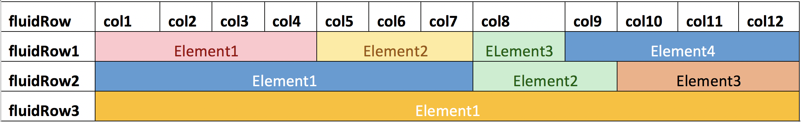

# 01. Architecture

Separate `ui.R` and `server.R`:

```
01-architecture/example-1
├── code # all .R scripts go here
├── input # input files
├── output # output files
├── server.R # update outputs using some input variable or by calling functions
├── ui.R # define layout, input and output elements
├── www # files like .css, .js, .png
└── ... # any number of directories or organization folders
```

ui and server in a single `app.R`:

```
01-architecture/example-2
├── app.R # combines ui and server in one script
└── ... # add similar directories as shown above
```

# 02. Layouts

In this section we will talk about how to arrange the shiny components i.e. inputs and outputs. These are the following types of most commonly used layouts: 

## Fluid Page

The `fluidPage` function is used to create fluid page layouts. A fluid page layout consists of rows which in turn include columns. 

 

### Sidebar layout

This is the most basic layout and is called by the function `sidebarLayout` and has two components: a side bar panel (`sidebarPanel`) which is used to lay out all the input components and a main panel (`mainPanel`) which is used to lay out the output components. There are two parameters to define the size and position:
- `width`: This is a panel-specific parameter. The combined width of sidebarPanel and mainPanel cannot exceed 12.
- `position`: This is a sidebarLayout parameter. Allowed values: `left` or `right` 

### Grid layout

Shiny's grid system using combinations of rows (`fluidRow`) & columns (`column`). This layout is used to better organize the inputs and outputs. Rows (`fluidRow`) and Columns (`column`) define how the elements are organized horizontally and vertically. Rows exist for the purpose of making sure their elements appear on the same line. Columns exist for the purpose of defining how much width each element takes within a 12-unit wide grid.

### Segmented layout

This uses Tabsets (`tabsetPanel`) or Navigation Lists (`navlistPanel`) to organize any kind of layout into discrete sections. Navigation lists can be used when you want to subdivide tabsets into sub-sections.

## Navbar Pages

This allows for multiple sub-components: each with their own layout for e.g. sidebar, grid, tabsets etc. Here, instead of `fluidPage`, use `navbarPage`.

## Dashboards


Some pointers:

1. Use Grid layout for better organization
1. Use `DT::dataTableOutput`, `DT::renderDataTable` and `DT::datatable` functions for data tables (flexible and customizable)
